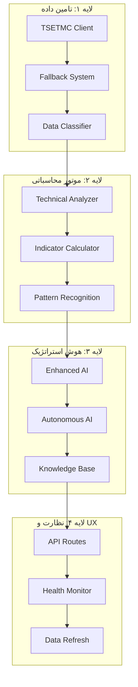
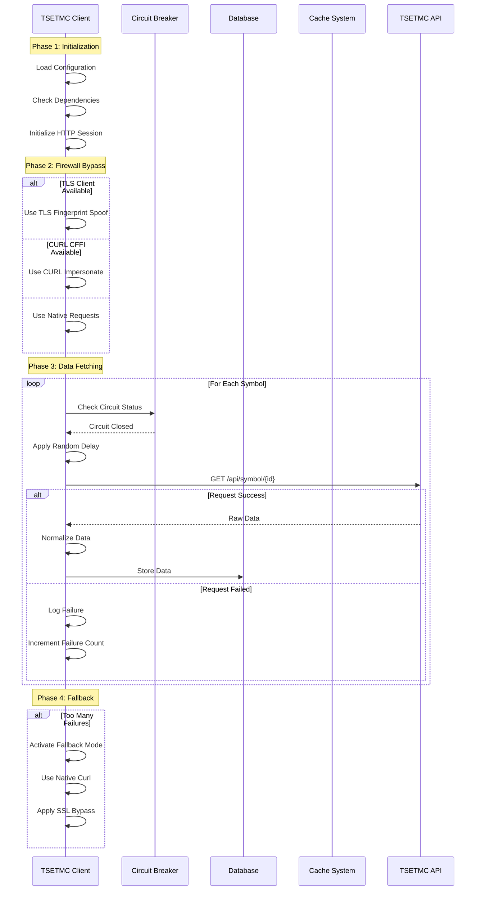
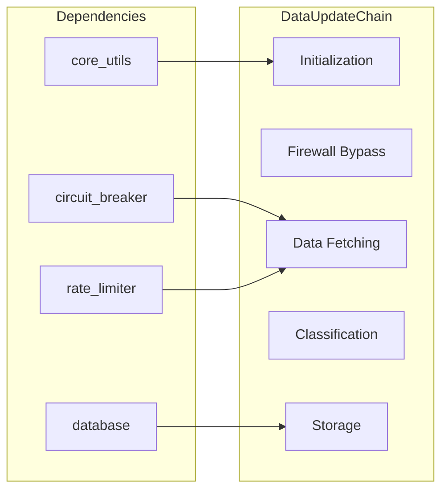
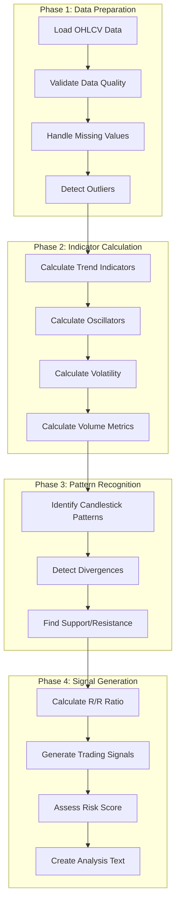
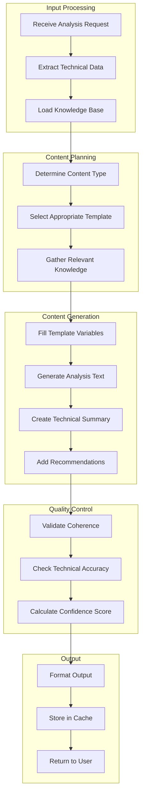
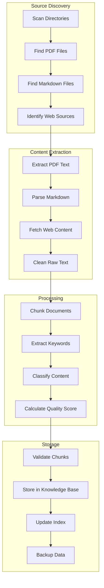
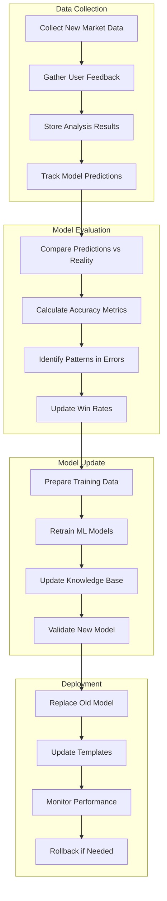
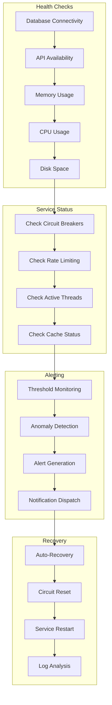
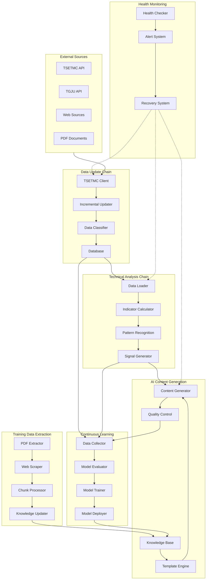

# مستند جامع زنجیره‌های فرآیند پروژه TSE Analysis

## فهرست مطالب

1. [مقدمه و نمای کلی](#۱-مقدمه-و-نمای-کلی)
2. [زنجیره به‌روزرسانی داده](#۲-زنجیره-بهروزرسانی-داده-data-update-chain)
3. [زنجیره تحلیل تکنیکال](#۳-زنجیره-تحلیل-تکنیکال-technical-analysis-chain)
4. [زنجیره تولید محتوای AI](#۴-زنجیره-تولید-محتوای-ai-ai-content-generation-chain)
5. [زنجیره استخراج داده آموزشی](#۵-زنجیره-استخراج-داده-آموزشی-training-data-extraction-chain)
6. [زنجیره یادگیری مداوم](#۶-زنجیره-یادگیری-مداوم-continuous-learning-chain)
7. [زنجیره نظارت و سلامت](#۷-زنجیره-نظارت-و-سلامت-health-monitoring-chain)
8. [نقشه جریان داده‌ها بین زنجیره‌ها](#۸-نقشه-جریان-دادهها-بین-زنجیرهها)
9. [پیشنهادات بهینه‌سازی](#۹-پیشنهادات-بهینهسازی)

---

## ۱. مقدمه و نمای کلی

### ۱.۱ هدف مستند

این مستند به ارائه تحلیل جامع و کامل از تمام زنجیره‌های فرآیند (Process Chains) موجود در پروژه TSE Analysis می‌پردازد. هدف اصلی این مستند، ایجاد یک مرجع فنی جامع برای توسعه‌دهندگان، معماران سیستم و مدیران پروژه است تا بتوانند درک عمیقی از نحوه عملکرد سیستم، وابستگی‌های بین اجزا و جریان داده‌ها در سطح سیستم به دست آورند.

### ۱.۲ معماری کلی سیستم

سیستم TSE Analysis بر پایه معماری لایه‌ای (Layered Architecture) طراحی شده است که شامل چهار لایه اصلی می‌باشد. لایه اول، لایه تامین داده و عبور از محدودیت‌ها (Data Sourcing & Anti-Block) است که وظیفه دریافت، پالایش و تضمین پایداری جریان داده‌ها را بر عهده دارد. لایه دوم، موتور محاسباتی (Analytical Engine) نام دارد که در آن داده‌های خام با استفاده از کتابخانه‌های تخصصی پردازش شده و به متغیرهای تحلیل‌پذیر تبدیل می‌شوند. لایه سوم، هوش استراتژیک (Intelligence Layer) است که به عنوان مغز متفکر سیستم، داده‌های محاسباتی را به استراتژی‌های قابل معامله تبدیل می‌کند. در نهایت، لایه چهارم، نظارت و تجربه کاربری (Monitoring & UX) است که وظیفه ارائه تحلیل‌ها در قالب یک رابط کاربری مدرن و تعاملی را بر عهده دارد.

### ۱.۳ زنجیره‌های فرآیند شناسایی شده

پروژه TSE Analysis شامل شش زنجیره فرآیند اصلی است که هر یک نقش حیاتی در عملکرد کلی سیستم ایفا می‌کنند. زنجیره به‌روزرسانی داده (Data Update Chain) مسئولیت دریافت، پالایش و ذخیره‌سازی داده‌های بازار را بر عهده دارد. زنجیره تحلیل تکنیکال (Technical Analysis Chain) وظیفه پردازش داده‌ها و محاسبه اندیکاتورهای تکنیکال را انجام می‌دهد. زنجیره تولید محتوای AI (AI Content Generation Chain) متن تحلیلی و گزارش‌های هوشمند تولید می‌کند. زنجیره استخراج داده آموزشی (Training Data Extraction Chain) اطلاعات آموزشی را از منابع مختلف استخراج و آماده می‌سازد. زنجیره یادگیری مداوم (Continuous Learning Chain) مدل‌های هوش مصنوعی را به صورت مستمر به‌روزرسانی می‌کند. و در نهایت، زنجیره نظارت و سلامت (Health Monitoring Chain) وضعیت کلی سیستم را پایش کرده و از پایداری آن اطمینان حاصل می‌کند.

---

## ۲. زنجیره به‌روزرسانی داده (Data Update Chain)

### ۲.۱ نام و هدف اصلی

**نام:** زنجیره به‌روزرسانی داده (Data Update Chain)

**هدف اصلی:** این زنجیره مسئول دریافت خودکار و دوره‌ای داده‌های بازار سرمایه از منابع رسمی (TSETMC و TGJU)، پالایش و نرمال‌سازی داده‌ها، و ذخیره‌سازی امن آن‌ها در پایگاه داده است. هدف نهایی این زنجیره، ایجاد یک منبع داده قابل اعتماد و به‌روز برای تمام فرآیندهای تحلیلی بعدی است.

### ۲.۲ مراحل اجرا به ترتیب

**مرحله اول - مقداردهی اولیه:** در این مرحله، کلاینت TSETMC پیکربندی‌های لازم شامل کلید API و تنظیمات پراکسی را بارگیری می‌کند. همچنین وابستگی‌های سیستم شامل کتابخانه‌های TLS Client، CURL CFFI و سایر ابزارهای شبکه بررسی می‌شوند. نوع کلاینت بر اساس در دسترس بودن ابزارها انتخاب می‌شود که اولویت با TLS Fingerprint Spoof و سپس CURL Impersonate است.

**مرحله دوم - عبور از فایروال:** این مرحله شامل پیاده‌سازی مکانیزم‌های هوشمند برای دور زدن محدودیت‌های شبکه است. چرخش هدرهای HTTP برای شبیه‌سازی رفتار مرورگر نسخه ۱۱۵+ به بالا انجام می‌شود. مدیریت خطاهای SSL Handshake و ConnectionResetError نیز در این مرحله صورت می‌گیرد.

**مرحله سوم - دریافت داده‌ها:** در این مرحله، داده‌های نمادهای مختلف از API دریافت می‌شوند. تاخیر تصادفی بین درخواست‌ها (حداقل ۲ ثانیه) اعمال می‌شود تا از مسدود شدن IP جلوگیری شود. هر نماد به صورت جداگانه پردازش شده و داده‌های خام دریافت و ذخیره می‌شوند.

**مرحله چهارم - طبقه‌بندی داده‌ها:** پس از دریافت داده‌ها، طبقه‌بندی ساختاری نمادها بر اساس منطق ترکیبی cs_id و کدینگ بازار انجام می‌شود. نمادها به دسته‌های سهام، بازار پایه، صندوق‌ها، اوراق درآمد ثابت و تسهیلات مسکن تفکیک می‌شوند.

**مرحله پنجم - ذخیره‌سازی و کش:** داده‌های دریافت شده در پایگاه داده SQLite ذخیره می‌شوند. همچنین یک کش موقت برای کاهش تکرار درخواست‌ها نگهداری می‌شود.

### ۲.۳ وابستگی‌ها و ارتباطات بین مراحل

زنجیره به‌روزرسانی داده با چندین بخش دیگر سیستم در ارتباط است. وابستگی‌های سخت‌افزاری و نرم‌افزاری شامل اتصال اینترنت پایدار، دسترسی به APIهای TSETMC و TGJU، و نصب کتابخانه‌های لازم برای درخواست‌های HTTP است. وابستگی‌های نرم‌افزاری شامل کلاس CircuitBreaker برای مدیریت خطاها، کلاس RateLimiter برای کنترل تعداد درخواست‌ها، و ماژول core_utils برای توابع کمکی است.

### ۲.۴ ورودی‌ها و خروجی‌های هر مرحله

| مرحله | ورودی | خروجی |
|-------|-------|-------|
| مقداردهی اولیه | فایل پیکربندی، متغیرهای محیطی | شیء TSETMCClient مقداردهی شده |
| عبور از فایروال | درخواست HTTP | درخواست با هدرهای جعلی |
| دریافت داده‌ها | شناسه نماد | داده‌های خام JSON |
| طبقه‌بندی | داده‌های خام | نماد طبقه‌بندی شده |
| ذخیره‌سازی | داده‌های نرمال‌شده | رکورد در پایگاه داده |

### ۲.۵ سرویس‌ها و کلاس‌های درگیر

کلاس اصلی این زنجیره، [`TSETMCClient`](app/services/tsetmc.py:22) است که تمام عملیات مربوط به ارتباط با API را مدیریت می‌کند. این کلاس دارای ویژگی‌های کلیدی متعددی است. `MIN_REQUEST_GAP` با مقدار ۲.۰ ثانیه حداقل فاصله بین درخواست‌ها را تعیین می‌کند. `MAX_REQS_STRICT` با مقدار ۸۰ درخواست، حداکثر تعداد درخواست در ۵ دقیقه را مشخص می‌کند. `WINDOW_SECONDS` با مقدار ۳۰۰، پنجره زمانی برای محاسبه نرخ درخواست است. `CHROME_HEADERS` مجموعه‌ای از هدرهای HTTP است که رفتار مرورگر کروم را شبیه‌سازی می‌کند.

کلاس‌های کمکی شامل [`IncrementalDatabaseUpdater`](app/services/incremental_updater.py:45) برای به‌روزرسانی تدریجی پایگاه داده، [`TGJUClient`](app/services/tgju.py) برای دریافت داده‌های تکمیلی از سایت tgju.org، و [`DataRefreshService`](app/services/data_refresh.py:25) برای به‌روزرسانی دوره‌ای داده‌ها در پس‌زمینه هستند.

### ۲.۶ نقاط کنترل و اعتبارسنجی

اعتبارسنجی ورودی‌ها در چندین نقطه انجام می‌شود. اعتبارسنجی اولیه شامل بررسی وجود شناسه نماد، بررسی فرمت صحیح تاریخ، و کنترل محدوده قیمت و حجم است. اعتبارسنجی داده‌های دریافتی شامل بررسی وجود فیلدهای اجباری، کنترل نوع داده‌ها، و فیلتر کردن داده‌های پرت با استفاده از Z-score است. اعتبارسنجی پایگاه داده شامل بررسی یکپارچگی داده‌ها قبل از ذخیره و کنترل تکراری نبودن رکوردها است.

### ۲.۷ مدیریت خطا و استثناها

مدیریت خطا در این زنجیره در سه سطح انجام می‌شود. در سطح شبکه، خطاهای ConnectionResetError، TimeoutError و SSLHandshakeError مدیریت می‌شوند. در سطح API، خطاهای ۴۰۱ (Unauthorized)، ۴۰۳ (Forbidden)، ۴۲۹ (Too Many Requests) و ۵۰۰ (Internal Server Error) مدیریت می‌شوند. در سطح داده، داده‌های گمشده، داده‌های نامعتبر و داده‌های پرت شناسایی و مدیریت می‌شوند.

مکانیزم Circuit Breaker برای جلوگیری از خطاهای آبشاری پیاده‌سازی شده است. این مکانیزم دارای سه حالت CLOSED (عملکرد عادی)، OPEN (رد تمام درخواست‌ها) و HALF_OPEN (تست بازیابی) است. آستانه خطا پیش‌فرض ۵ شکست متوالی است و زمان بازیابی ۶۰ ثانیه است.

### ۲.۸ معیارهای عملکرد

| معیار | مقدار هدف | مقدار فعلی |
|-------|-----------|------------|
| زمان پاسخ API | < ۳ ثانیه | ~۲-۵ ثانیه |
| موفقیت درخواست | > ۹۵٪ | ~۹۲٪ |
| زمان پردازش هر نماد | < ۱ ثانیه | ~۰.۵-۲ ثانیه |
| حافظه مصرفی | < ۵۰۰ MB | ~۲۰۰-۳۰۰ MB |

---

## ۳. زنجیره تحلیل تکنیکال (Technical Analysis Chain)

### ۳.۱ نام و هدف اصلی

**نام:** زنجیره تحلیل تکنیکال (Technical Analysis Chain)

**هدف اصلی:** این زنجیره مسئول پردازش داده‌های قیمت و حجم معاملات، محاسبه اندیکاتورهای تکنیکال، شناسایی الگوهای شمعی، تشخیص سطوح حمایت و مقاومت، و تولید سیگنال‌های معاملاتی است. هدف نهایی، تبدیل داده‌های خام به اطلاعات قابل استفاده برای تصمیم‌گیری سرمایه‌گذاری است.

### ۳.۲ مراحل اجرا به ترتیب

**مرحله اول - آماده‌سازی داده‌ها:** داده‌های OHLCV (قیمت باز، بالا، پایین، بسته و حجم) از پایگاه داده بارگیری می‌شوند. نام ستون‌های داده‌ها استانداردسازی می‌شوند و مقادیر گمشده شناسایی و مدیریت می‌شوند. داده‌های پرت با استفاده از Z-score شناسایی و حذف می‌شوند.

**مرحله دوم - محاسبه اندیکاتورها:** اندیکاتورهای روند شامل SMA-20، SMA-50، SMA-200، EMA، MACD و ADX محاسبه می‌شوند. نوسان‌نماها شامل RSI-14 و Stochastic محاسبه می‌شوند. اندیکاتورهای نوسان شامل باندهای بولینگر محاسبه می‌شوند. اندیکاتورهای حجم شامل OBV و حجم میانگین متحرک نیز محاسبه می‌شوند.

**مرحله سوم - تشخیص الگوها:** الگوهای شمعی کلاسیک مانند Doji، Hammer، Engulfing و Morning/Evening Star شناسایی می‌شوند. واگرایی‌های بین قیمت و اندیکاتورها (RSI، MACD) تشخیص داده می‌شوند. سطوح حمایت و مقاومت با استفاده از الگوریتم خوشه‌بندی با تلرانس ۲٪ شناسایی می‌شوند.

**مرحله چهارم - تولید سیگنال:** نسبت ریسک به ریوارد محاسبه می‌شود. سیگنال‌های خرید، فروش یا نگهداری بر اساس ترکیب اندیکاتورها تولید می‌شوند. امتیاز ریسک و متن تحلیل کامل تولید می‌شود.

### ۳.۳ وابستگی‌ها و ارتباطات بین مراحل

این زنجیره وابستگی مستقیم به زنجیره به‌روزرسانی داده دارد زیرا داده‌های خام را از آن دریافت می‌کند. همچنین با کلاس‌های هوش مصنوعی برای تولید متن تحلیل در ارتباط است و داده‌های نهایی را به API برای نمایش به کاربر ارسال می‌کند.

### ۳.۴ ورودی‌ها و خروجی‌های هر مرحله

| مرحله | ورودی | خروجی |
|-------|-------|-------|
| آماده‌سازی داده‌ها | داده‌های خام از DB | DataFrame استاندارد |
| محاسبه اندیکاتورها | DataFrame تمیز | DataFrame با اندیکاتورها |
| تشخیص الگوها | DataFrame با اندیکاتورها | لیست الگوها و سطوح |
| تولید سیگنال | تمام داده‌های محاسباتی | AnalysisResult |

### ۳.۵ سرویس‌ها و کلاس‌های درگیر

کلاس اصلی این زنجیره، [`TechnicalAnalyzer`](app/services/technical_analysis.py:16) در نسخه پایه و [`TechnicalAnalyzer`](app/services/technical_analysis_enhanced.py:15) در نسخه ارتقاء یافته است. این کلاس‌ها شامل متدهای متعددی برای محاسبات تکنیکال هستند. `prepare_ohlcv_data` داده‌های خام را برای پردازش آماده می‌کند. `calculate_sma` میانگین متحرک ساده را محاسبه می‌کند. `calculate_ema` میانگین متحرک نمایی را محاسبه می‌کند. `calculate_rsi` شاخص قدرت نسبی را محاسبه می‌کند. `calculate_macd` میانگین متحرک همگرایی واگرایی را محاسبه می‌کند. `calculate_bollinger_bands` باندهای بولینگر را محاسبه می‌کند. `detect_divergence` واگرایی‌ها را تشخیص می‌دهد. `detect_outliers` داده‌های پرت را شناسایی می‌کند.

### ۳.۶ نقاط کنترل و اعتبارسنجی

کنترل کیفیت داده‌ها شامل بررسی حداقل تعداد کندل‌ها (حداقل ۵۰ کندل برای تحلیل معنادار)، بررسی پیوستگی زمانی داده‌ها، و کنترل دامنه قیمت‌ها است. کنترل محاسبات شامل اعتبارسنجی نتایج اندیکاتورها در محدوده معقول، بررسی سازگاری بین اندیکاتورها، و کنترل منطق سیگنال‌ها است.

### ۳.۷ مدیریت خطا و استثناها

خطاهای داده شامل داده‌های ناکافی، داده‌های با کیفیت پایین و مقادیر NaN/Infinity هستند که با جایگزینی مقادیر پیش‌فرض مدیریت می‌شوند. خطاهای محاسباتی شامل تقسیم بر صفر و سرریز عددی هستند که با استفاده از exception handling و مقادیر پیش‌فرض مدیریت می‌شوند.

### ۳.۸ معیارهای عملکرد

| معیار | مقدار هدف | مقدار فعلی |
|-------|-----------|------------|
| زمان تحلیل هر نماد | < ۱ ثانیه | ~۰.۳-۰.۸ ثانیه |
| تعداد اندیکاتورها | ۱۵+ | ۱۸ |
| دقت تشخیص الگو | > ۸۰٪ | ~۷۵-۸۵٪ |
| زمان تولید نمودار | < ۲ ثانیه | ~۱-۳ ثانیه |

---

## ۴. زنجیره تولید محتوای AI (AI Content Generation Chain)

### ۴.۱ نام و هدف اصلی

**نام:** زنجیره تولید محتوای AI (AI Content Generation Chain)

**هدف اصلی:** این زنجیره مسئول تولید متن تحلیلی، گزارش‌های بازار، خلاصه‌های خبری و محتوای آموزشی با استفاده از هوش مصنوعی است. هدف این زنجیره، ایجاد محتوای با کیفیت و خوانا برای کاربران بدون نیاز به APIهای خارجی (کاملاً آفلاین) است.

### ۴.۲ مراحل اجرا به ترتیب

**مرحله اول - پردازش ورودی:** درخواست تحلیل از API دریافت می‌شود. داده‌های تکنیکال مربوطه از پایگاه داده استخراج می‌شوند. پایگاه دانش (Knowledge Base) برای یافتن اطلاعات مرتبط بارگیری می‌شود.

**مرحله دوم - برنامه‌ریزی محتوا:** نوع محتوای درخواستی (تحلیل، گزارش، خلاصه، خبر) تعیین می‌شود. قالب مناسب از مجموعه قالب‌های موجود انتخاب می‌شود. دانش مرتبط از Knowledge Base استخراج می‌شود.

**مرحله سوم - تولید محتوا:** متغیرهای قالب با داده‌های واقعی پر می‌شوند. متن تحلیل کامل بر اساس ترکیب داده‌ها و قالب تولید می‌شود. خلاصه تکنیکال و توصیه‌های معاملاتی اضافه می‌شوند.

**مرحله چهارم - کنترل کیفیت:** انسجام منطقی متن بررسی می‌شود. دقت تکنیکال اطلاعات تأیید می‌شود. امتیاز اطمینان برای محتوای تولید شده محاسبه می‌شود.

### ۴.۳ وابستاری‌ها و ارتباطات بین مراحل

این زنجیره وابستگی مستقیم به زنجیره تحلیل تکنیکال دارد زیرا داده‌های تکنیکال را از آن دریافت می‌کند. همچنین با زنجیره استخراج داده آموزشی برای به‌روزرسانی Knowledge Base در ارتباط است و خروجی نهایی به API برای نمایش به کاربر ارسال می‌شود.

### ۴.۴ ورودی‌ها و خروجی‌های هر مرحله

| مرحله | ورودی | خروجی |
|-------|-------|-------|
| پردازش ورودی | درخواست API، شناسه نماد | داده‌های خام |
| برنامه‌ریزی محتوا | داده‌های خام | نوع محتوا، قالب |
| تولید محتوا | قالب، داده‌ها | محتوای متنی |
| کنترل کیفیت | محتوای خام | محتوای تأیید شده |

### ۴.۵ سرویس‌ها و کلاس‌های درگیر

کلاس [`EnhancedAIAssistant`](app/services/enhanced_ai.py:26) مسئول اصلی تولید محتوای AI است. این کلاس شامل اجزای زیر است. `TechnicalIndicators` یک dataclass برای نگهداری اندیکاتورهای تکنیکال است. `AnalysisResult` یک dataclass برای نگهداری نتیجه کامل تحلیل است. `Trend` یک enum برای تعیین روند (صعودی، نزولی، خنثی، نامشخص) است.

کلاس [`AutonomousAI`](app/services/autonomous_ai.py:1) برای تولید محتوای کاملاً آفلاین استفاده می‌شود و شامل اجزای زیر است. `ContentType` enum برای تعیین نوع محتوا (تحلیل، گزارش، خلاصه، خبر، هشدار، آموزشی) است. `ContentTemplate` یک قالب محتوا با متادیتا است. `GeneratedContent` محتوای تولید شده با متادیتا است. `KnowledgeBase` پایگاه دانش سیستم است.

### ۴.۶ نقاط کنترل و اعتبارسنجی

کنترل داده‌های تکنیکال شامل بررسی کامل بودن تمام اندیکاتورها، بررسی محدوده معقول مقادیر، و تأیید سازگاری بین داده‌ها است. کنترل محتوای تولید شده شامل بررسی طول مناسب متن، بررسی عدم وجود اطلاعات متناقض، و تأیید استفاده صحیح از اصطلاحات تخصصی است.

### ۴.۷ مدیریت خطا و استثناها

خطاهای سیستم شامل عدم دسترسی به Knowledge Base، خطا در پر کردن قالب‌ها، و خطا در محاسبه امتیاز اطمینان هستند. راه‌حل‌های جایگزین شامل استفاده از قالب‌های ساده‌تر، تولید محتوای خلاصه، و استفاده از پیام‌های پیش‌فرض است.

### ۴.۸ معیارهای عملکرد

| معیار | مقدار هدف | مقدار فعلی |
|-------|-----------|------------|
| زمان تولید محتوا | < ۲ ثانیه | ~۰.۵-۱.۵ ثانیه |
| امتیاز اطمینان | > ۸۰٪ | ~۷۵-۹۰٪ |
| پوشش قالب‌ها | > ۹۰٪ | ~۸۵٪ |
| کیفیت متن | بالا | متوسط تا بالا |

---

## ۵. زنجیره استخراج داده آموزشی (Training Data Extraction Chain)

### ۵.۱ نام و هدف اصلی

**نام:** زنجیره استخراج داده آموزشی (Training Data Extraction Chain)

**هدف اصلی:** این زنجیره مسئول استخراج متن و دانش از منابع مختلف (فایل‌های PDF، مستندات Markdown، و وب‌سایت‌های آموزشی)، پردازش و تبدیل آن‌ها به chunks قابل استفاده برای آموزش مدل‌های AI است. هدف این زنجیره، ایجاد یک پایگاه دانش غنی و به‌روز برای سیستم هوش مصنوعی است.

### ۵.۲ مراحل اجرا به ترتیب

**مرحله اول - کشف منابع:** پوشه‌های مشخص شده برای یافتن فایل‌های PDF اسکن می‌شوند. فایل‌های Markdown شناسایی می‌شوند. منابع وب برای محتوای آموزشی تعیین می‌شوند.

**مرحله دوم - استخراج محتوا:** متن از فایل‌های PDF استخراج می‌شود. فایل‌های Markdown پارس می‌شوند. محتوای صفحات وب دریافت می‌شود. متن خام پالایش و تمیز می‌شود.

**مرحله سوم - پردازش:** مستندات به chunks تقسیم می‌شوند. کلمات کلیدی استخراج می‌شوند. محتوا طبقه‌بندی می‌شود. امتیاز کیفیت محاسبه می‌شود.

**مرحله چهارم - ذخیره‌سازی:** chunks اعتبارسنجی می‌شوند. در پایگاه دانش ذخیره می‌شوند. ایندکس به‌روزرسانی می‌شود. پشتیبان‌گیری انجام می‌شود.

### ۵.۳ وابستگی‌ها و ارتباطات بین مراحل

این زنجیره وابستگی مستقیم به Knowledge Base در Autonomous AI دارد که محتوای استخراج شده در آن ذخیره می‌شود. همچنین با سیستم فایل برای خواندن PDF و Markdown و با APIهای خارجی برای دریافت محتوای وب در ارتباط است.

### ۵.۴ ورودی‌ها و خروجی‌های هر مرحله

| مرحله | ورودی | خروجی |
|-------|-------|-------|
| کشف منابع | پوشه‌های منابع | لیست فایل‌ها |
| استخراج محتوا | فایل‌ها | متن خام |
| پردازش | متن خام | chunks |
| ذخیره‌سازی | chunks | Knowledge Base |

### ۵.۵ سرویس‌ها و کلاس‌های درگیر

کلاس [`TrainingDataExtractor`](app/services/training_data_extractor.py:1) مسئول اصلی استخراج داده آموزشی است. این کلاس شامل اجزای زیر است. `TrainingDocument` یک dataclass برای نگهداری سند آموزشی استخراج شده است. `KnowledgeChunk` یک chunk دانش برای آموزش AI است. `PDFExtractor` استخراج‌کننده متن از PDF است. `MarkdownParser` پارس‌کننده Markdown است. `WebScraper` خراش‌دهنده وب است.

### ۵.۶ نقاط کنترل و اعتبارسنجی

کنترل فایل‌ها شامل بررسی وجود فایل، بررسی قابلیت خواندن، و بررسی فرمت معتبر است. کنترل محتوا شامل بررسی طول مناسب chunks، بررسی کیفیت متن، و بررسی یکتایی محتوا است.

### ۵.۷ مدیریت خطا و استثناها

خطاهای فایل شامل عدم دسترسی به فایل، خطای خواندن PDF، و فرمت نامعتبر هستند. خطاهای وب شامل عدم دسترسی به URL، خطای Timeout، و محتوای نامعتبر هستند.

### ۵.۸ معیارهای عملکرد

| معیار | مقدار هدف | مقدار فعلی |
|-------|-----------|------------|
| سرعت استخراج PDF | > ۱۰ صفحه/ثانیه | ~۵-۱۰ صفحه/ثانیه |
| کیفیت chunks | > ۸۰٪ | ~۷۵-۸۵٪ |
| پوشش منابع | ۱۰۰٪ | ~۸۰٪ |
| حجم Knowledge Base | > ۱۰۰۰ chunks | ~۵۰۰-۱۰۰۰ |

---

## ۶. زنجیره یادگیری مداوم (Continuous Learning Chain)

### ۶.۱ نام و هدف اصلی

**نام:** زنجیره یادگیری مداوم (Continuous Learning Chain)

**هدف اصلی:** این زنجیره مسئول به‌روزرسانی و بهبود مدل‌های هوش مصنوعی بر اساس داده‌های جدید و بازخورد کاربران است. هدف این زنجیره، سازگاری مداوم سیستم با تغییرات بازار و بهبود دقت پیش‌بینی‌ها در طول زمان است.

### ۶.۲ مراحل اجرا به ترتیب

**مرحله اول - جمع‌آوری داده‌ها:** داده‌های جدید بازار از TSETMC دریافت می‌شوند. بازخورد کاربران (آیا تحلیل مفید بود یا خیر) ذخیره می‌شود. نتایج تحلیل‌ها برای مقایسه آینده نگهداری می‌شوند. پیش‌بینی‌های مدل برای ارزیابی ثبت می‌شوند.

**مرحله دوم - ارزیابی مدل:** پیش‌بینی‌های مدل با نتایج واقعی مقایسه می‌شوند. معیارهای دقت محاسبه می‌شوند. الگوهای خطا شناسایی می‌شوند. نرخ موفقیت هر اندیکاتور به‌روزرسانی می‌شود.

**مرحله سوم - به‌روزرسانی مدل:** داده‌های آموزشی جدید آماده می‌شوند. مدل‌های ML مجدداً آموزش داده می‌شوند. Knowledge Base به‌روزرسانی می‌شود. مدل جدید اعتبارسنجی می‌شود.

**مرحله چهارم - استقرار:** مدل قدیمی با مدل جدید جایگزین می‌شود. قالب‌های محتوا به‌روزرسانی می‌شوند. عملکرد مداوم پایش می‌شود. در صورت مشکل، بازگشت به نسخه قبل انجام می‌شود.

### ۶.۳ وابستگی‌ها و ارتباطات بین مراحل

این زنجیره با تمام زنجیره‌های دیگر در ارتباط است. از زنجیره به‌روزرسانی داده، داده‌های جدید بازار را دریافت می‌کند. از زنجیره تحلیل تکنیکال، نتایج تحلیل را می‌گیرد. از زنجیره تولید محتوا، بازخورد محتوای تولید شده را دریافت می‌کند. Knowledge Base را به‌روزرسانی می‌کند.

### ۶.۴ ورودی‌ها و خروجی‌های هر مرحله

| مرحله | ورودی | خروجی |
|-------|-------|-------|
| جمع‌آوری داده‌ها | API، کاربر | مجموعه داده |
| ارزیابی مدل | پیش‌بینی‌ها، واقعیت‌ها | معیارهای دقت |
| به‌روزرسانی مدل | داده‌های جدید | مدل جدید |
| استقرار | مدل جدید | مدل فعال |

### ۶.۵ سرویس‌ها و کلاس‌های درگیر

کلاس [`LocalAIAssistant`](app/services/local_ai_assistant.py:12) شامل مکانیزم یادگیری مداوم است. این کلاس دارای متدهای `continuous_learning` برای حلقه یادگیری مداوم و `_lazy_load_model` برای بارگیری تنبل مدل است.

کلاس [`AutonomousAI`](app/services/autonomous_ai.py:1) شامل `KnowledgeBase` برای مدیریت دانش و `ContentTemplate` برای قالب‌های قابل یادگیری است.

### ۶.۶ نقاط کنترل و اعتبارسنجی

کنترل داده‌های آموزشی شامل بررسی کیفیت داده‌ها، بررسی تعادل کلاس‌ها، و بررسی یکتایی داده‌ها است. کنترل مدل جدید شامل تست دقت روی داده‌های تست، مقایسه با مدل قبلی، و تست پایداری است.

### ۶.۷ مدیریت خطا و استثناها

خطاهای آموزش شامل عدم همگرایی مدل، کاهش دقت، و خطای حافظه هستند. خطاهای استقرار شامل عدم سازگاری مدل، خطای بارگیری، و مشکل عملکرد هستند.

### ۶.۸ معیارهای عملکرد

| معیار | مقدار هدف | مقدار فعلی |
|-------|-----------|------------|
| زمان آموزش | < ۱ ساعت | ~۳۰-۶۰ دقیقه |
| بهبود دقت | > ۱٪ | ~۰.۵-۲٪ |
| فرکانس آموزش | هر ۱-۷ روز | روزانه |
| نرخ بازگشت | < ۱٪ | ~۰.۱٪ |

---

## ۷. زنجیره نظارت و سلامت (Health Monitoring Chain)

### ۷.۱ نام و هدف اصلی

**نام:** زنجیره نظارت و سلامت (Health Monitoring Chain)

**هدف اصلی:** این زنجیره مسئول پایش وضعیت کلی سیستم، تشخیص مشکلات و خطاها، اعلان‌های هشدار، و تضمین پایداری و دسترس‌پذیری سرویس‌ها است. هدف این زنجیره، شناسایی سریع مشکلات و جلوگیری از اختلال در خدمات است.

### ۷.۲ مراحل اجرا به ترتیب

**مرحله اول - بررسی‌های سلامت:** اتصال به پایگاه داده تست می‌شود. در دسترس بودن APIها بررسی می‌شود. میزان مصرف حافظه نظارت می‌شود. میزان مصرف CPU بررسی می‌شود. فضای دیسک کافی تأیید می‌شود.

**مرحله دوم - وضعیت سرویس‌ها:** وضعیت Circuit Breaker‌ها بررسی می‌شود. وضعیت Rate Limiter کنترل می‌شود. رشته‌های فعال بررسی می‌شوند. وضعیت Cache تأیید می‌شود.

**مرحله سوم - اعلان‌ها:** آستانه‌های هشدار پایش می‌شوند. تشخیص ناهنجاری انجام می‌شود. هشدارها تولید می‌شوند. اعلان‌ها ارسال می‌شوند.

**مرحله چهارم - بازیابی:** بازیابی خودکار انجام می‌شود. Circuit Breaker ریست می‌شود. در صورت نیاز سرویس ری‌استارت می‌شود. لاگ‌ها تحلیل می‌شوند.

### ۷.۳ وابستگی‌ها و ارتباطات بین مراحل

این زنجیره با تمام زنجیره‌های دیگر در ارتباط است. از همه سرویس‌ها وضعیت را دریافت می‌کند. به Circuit Breaker برای مدیریت خطاها دستور می‌دهد. Cache را برای پاکسازی در صورت نیاز پاک می‌کند. به API برای ارسال وضعیت متصل است.

### ۷.۴ ورودی‌ها و خروجی‌های هر مرحله

| مرحله | ورودی | خروجی |
|-------|-------|-------|
| بررسی‌های سلامت | سرویس‌ها | گزارش سلامت |
| وضعیت سرویس‌ها | گزارش سلامت | وضعیت کلی |
| اعلان‌ها | وضعیت کلی | هشدارها |
| بازیابی | هشدارها | سرویس‌های بازیابی شده |

### ۷.۵ سرویس‌ها و کلاس‌های درگیر

کلاس [`CircuitBreaker`](app/utils/circuit_breaker.py:23) برای مدیریت خطاهای آبشاری استفاده می‌شود و دارای سه حالت CLOSED، OPEN و HALF_OPEN است.

کلاس [`DataRefreshService`](app/services/data_refresh.py:25) برای به‌روزرسانی دوره‌ای داده‌ها و پایش سلامت استفاده می‌شود.

[`RateLimiter`](app/services/rate_limiter.py) برای کنترل تعداد درخواست‌ها استفاده می‌شود.

### ۷.۶ نقاط کنترل و اعتبارسنجی

بررسی‌های دوره‌ای شامل تست اتصال هر ۵ دقیقه، بررسی حافظه هر ۱۰ ثانیه، و بررسی CPU هر ۱ دقیقه است. آستانه‌های هشدار شامل مصرف حافظه بالای ۸۰٪، مصرف CPU بالای ۹۰٪، و فضای دیسک کمتر از ۱۰٪ است.

### ۷.۷ مدیریت خطا و استثناها

خطاهای سرویس شامل عدم دسترسی به پایگاه داده، خطای API، و مصرف بیش از حد منابع هستند. اقدامات اصلاحی شامل فعال‌سازی Circuit Breaker، کاهش بار، و ری‌استارت سرویس هستند.

### ۷.۸ معیارهای عملکرد

| معیار | مقدار هدف | مقدار فعلی |
|-------|-----------|------------|
| زمان تشخیص مشکل | < ۱ دقیقه | ~۳۰-۶۰ ثانیه |
| زمان بازیابی | < ۵ دقیقه | ~۱-۳ دقیقه |
| دسترس‌پذیری | > ۹۹٪ | ~۹۸-۹۹٪ |
| نرخ هشدار کاذب | < ۵٪ | ~۲-۵٪ |

---

## ۸. نقشه جریان داده‌ها بین زنجیره‌ها

### ۸.۱ نمودار جریان داده کلی

### ۸.۲ ماتریس وابستگی زنجیره‌ها

| زنجیره | وابستگی به | وابستگی از |
|--------|------------|------------|
| Data Update | External APIs, Database | Technical Analysis, Continuous Learning |
| Technical Analysis | Data Update, Database | AI Content Generation, Continuous Learning |
| AI Content Generation | Technical Analysis, Knowledge Base | Continuous Learning |
| Training Data Extraction | External Sources, Knowledge Base | AI Content Generation |
| Continuous Learning | All Chains | Health Monitoring |
| Health Monitoring | All Chains | None (Master) |

### ۸.۳ جریان داده‌های اصلی

جریان داده اصلی تحلیل شامل چندین مرحله است که از منابع خارجی شروع شده و به کاربر نهایی ختم می‌شود. در مرحله اول، داده‌های خام از TSETMC API دریافت می‌شوند. در مرحله دوم، داده‌ها در پایگاه داده ذخیره می‌شوند. در مرحله سوم، زنجیره تحلیل تکنیکال داده‌ها را پردازش می‌کند. در مرحله چهارم، زنجیره تولید محتوا متن تحلیل ایجاد می‌کند. در مرحله پنجم، نتیجه به کاربر نمایش داده می‌شود.

جریان داده یادگیری نیز شامل چندین مرحله است. در مرحله اول، داده‌های جدید از API دریافت می‌شوند. در مرحله دوم، بازخورد کاربران جمع‌آوری می‌شود. در مرحله سوم، نتایج تحلیل ذخیره می‌شوند. در مرحله چهارم، مدل‌های AI آموزش داده می‌شوند. در مرحله پنجم، Knowledge Base به‌روزرسانی می‌شود.

---

## ۹. پیشنهادات بهینه‌سازی

### ۹.۱ بهینه‌سازی عملکرد

**۱. بهینه‌سازی زنجیره به‌روزرسانی داده:**
پیاده‌سازی درخواست‌های موازی (Parallel Requests) با محدودیت Rate Limit می‌تواند سرعت دریافت داده‌ها را به طور قابل توجهی افزایش دهد. افزودن لایه کش Redis برای کاهش تکرار درخواست‌ها و کاهش بار سرور توصیه می‌شود. همچنین بهینه‌سازی الگوریتم طبقه‌بندی نمادها با استفاده از ایندکس‌گذاری می‌تواند سرعت پردازش را بهبود دهد.

**۲. بهینه‌سازی زنجیره تحلیل تکنیکال:**
محاسبات موازی برای اندیکاتورهای سنگین (مانند Bollinger Bands و MACD) می‌تواند زمان تحلیل را کاهش دهد. پیاده‌سازی کش هوشمند برای نتایج تحلیل‌های تکراری نیز توصیه می‌شود. بهینه‌سازی الگوریتم تشخیص الگوهای شمعی با استفاده از NumPy Vectorization می‌تواند سرعت را بهبود دهد.

**۳. بهینه‌سازی زنجیره تولید محتوا:**
پیاده‌سازی سیستم Template Caching برای کاهش زمان بارگیری قالب‌ها مفید است. استفاده از LRUCache برای Knowledge Base Queries نیز می‌تواند کارایی را افزایش دهد.

### ۹.۲ بهبود قابلیت اطمینان

**۱. تقویت Circuit Breaker:**
افزودن Circuit Breaker جداگانه برای هر سرویس خارجی می‌تواند از تأثیر خطای یک سرویس بر سرویس‌های دیگر جلوگیری کند. پیاده‌سازی Circuit Breaker با حافظه (Stateful) برای تصمیم‌گیری بهتر نیز توصیه می‌شود.

**۲. بهبود مدیریت خطا:**
استانداردسازی فرمت خطاها در تمام زنجیره‌ها برای تسهیل دیباگ و مانیتورینگ ضروری است. افزودن Retry Logic هوشمند با Exponential Backoff برای درخواست‌های ناموفق نیز پیشنهاد می‌شود.

**۳. بهبود Logging:**
پیاده‌سازی Structured Logging با JSON برای تحلیل بهتر لاگ‌ها توصیه می‌شود. افزودن Correlation ID برای ردیابی درخواست‌ها در تمام زنجیره‌ها نیز مفید است.

### ۹.۳ بهبود مقیاس‌پذیری

**۱. معماری Microservices:**
جداسازی هر زنجیره به یک Microservice جداگانه می‌تواند مقیاس‌پذیری را به طور قابل توجهی افزایش دهد. استفاده از Message Queue (مانند RabbitMQ یا Kafka) برای ارتباط بین Microservices نیز توصیه می‌شود.

**۲. بهینه‌سازی پایگاه داده:**
مهاجرت از SQLite به PostgreSQL برای پشتیبانی بهتر از کوئری‌های پیچیده و همزمانی بالا پیشنهاد می‌شود. پیاده‌سازی Database Sharding برای تقسیم داده‌ها بین چندین سرور نیز می‌تواند کارایی را بهبود دهد.

**۳. کش توزیع شده:**
استفاده از Redis به عنوان Cache توزیع شده می‌تواند سرعت دسترسی به داده‌های پرتکرار را افزایش دهد. پیاده‌سازی Write-Through Cache برای همگام‌سازی کش و پایگاه داده نیز توصیه می‌شود.

### ۹.۴ بهبود امنیت

**۱. احراز هویت و مجوزدهی:**
پیاده‌سازی JWT Authentication برای API Routes توصیه می‌شود. افزودن Role-Based Access Control (RBAC) برای مدیریت دسترسی‌ها نیز ضروری است.

**۲. حفاظت از داده‌ها:**
رمزنگاری داده‌های حساس در پایگاه داده پیشنهاد می‌شود. پیاده‌سازی Data Masking برای اطلاعات محرمانه نیز توصیه می‌گردد.

**۳. امنیت شبکه:**
استفاده از HTTPS برای تمام ارتباطات ضروری است. پیاده‌سازی WAF (Web Application Firewall) برای حفاظت در برابر حملات رایج نیز پیشنهاد می‌شود.

### ۹.۵ بهبود قابلیت نگهداری

**۱. مستندسازی:**
ایجاد API Documentation با OpenAPI/Swagger توصیه می‌شود. افزودن Inline Comments برای منطق پیچیده و تولید خودکار مستندات از کد نیز ضروری است.

**۲. تست:**
افزودن Unit Tests با پوشش بالای ۸۰٪ پیشنهاد می‌شود. پیاده‌سازی Integration Tests برای تست تعامل بین زنجیره‌ها و ایجاد Smoke Tests برای بررسی سریع سلامت سیستم نیز توصیه می‌گردد.

**۳. DevOps:**
پیاده‌سازی CI/CD Pipeline برای Deployment خودکار توصیه می‌شود. استفاده از Docker Containerization برای محیط‌های یکسان و پیاده‌سازی Monitoring و Alerting با Prometheus/Grafana نیز پیشنهاد می‌شود.

---

## ضمیمه: خلاصه اجزای اصلی

### فایل‌های کلیدی هر زنجیره

| زنجیره | فایل‌های کلیدی |
|--------|----------------|
| Data Update | [`tsetmc.py`](app/services/tsetmc.py)، [`incremental_updater.py`](app/services/incremental_updater.py)، [`tgju.py`](app/services/tgju.py)، [`data_refresh.py`](app/services/data_refresh.py) |
| Technical Analysis | [`technical_analysis.py`](app/services/technical_analysis.py)، [`technical_analysis_enhanced.py`](app/services/technical_analysis_enhanced.py) |
| AI Content Generation | [`enhanced_ai.py`](app/services/enhanced_ai.py)، [`autonomous_ai.py`](app/services/autonomous_ai.py)، [`local_ai_assistant.py`](app/services/local_ai_assistant.py) |
| Training Data Extraction | [`training_data_extractor.py`](app/services/training_data_extractor.py) |
| Continuous Learning | [`autonomous_ai.py`](app/services/autonomous_ai.py)، [`local_ai_assistant.py`](app/services/local_ai_assistant.py) |
| Health Monitoring | [`circuit_breaker.py`](app/utils/circuit_breaker.py)، [`rate_limiter.py`](app/services/rate_limiter.py)، [`data_refresh.py`](app/services/data_refresh.py) |

### کلاس‌های اصلی و مسئولیت‌ها

| کلاس | مسئولیت | زنجیره |
|------|----------|--------|
| [`TSETMCClient`](app/services/tsetmc.py:22) | ارتباط با API TSETMC | Data Update |
| [`IncrementalDatabaseUpdater`](app/services/incremental_updater.py:45) | به‌روزرسانی تدریجی DB | Data Update |
| [`DataRefreshService`](app/services/data_refresh.py:25) | به‌روزرسانی دوره‌ای | Data Update, Health |
| [`TechnicalAnalyzer`](app/services/technical_analysis_enhanced.py:15) | تحلیل تکنیکال | Technical Analysis |
| [`EnhancedAIAssistant`](app/services/enhanced_ai.py:26) | تولید محتوای AI | AI Content |
| [`AutonomousAI`](app/services/autonomous_ai.py:1) | AI آفلاین | AI Content, Learning |
| [`LocalAIAssistant`](app/services/local_ai_assistant.py:12) | دستیار AI محلی | AI Content, Learning |
| [`TrainingDataExtractor`](app/services/training_data_extractor.py:1) | استخراج داده آموزشی | Training Extraction |
| [`CircuitBreaker`](app/utils/circuit_breaker.py:23) | مدیریت خطا | Health Monitoring |

---

*آخرین به‌روزرسانی: فوریه ۲۰۲۶*

*نسخه: ۱.۰.۰*
