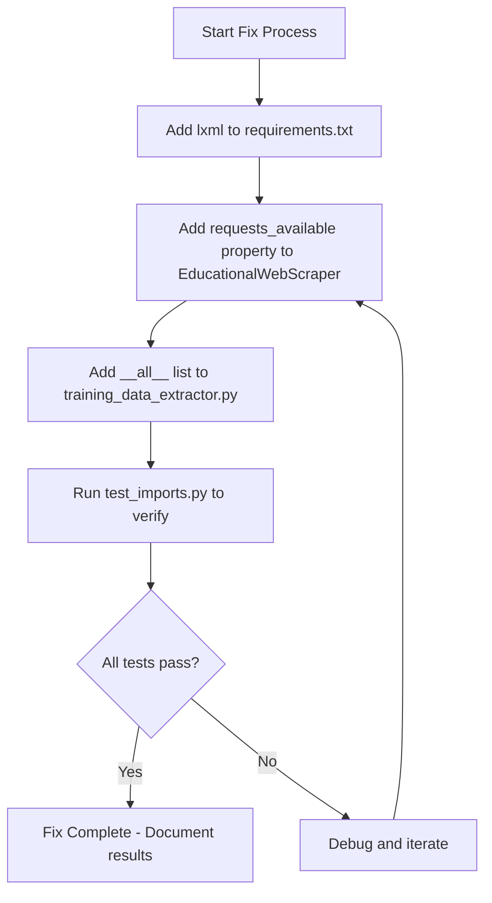

# Import Fix Plan for TSEAnalysis

## Problem Statement
The TSEAnalysis project has Python import errors and undefined variable issues related to:
- Missing `lxml` dependency
- Missing `requests_available` property in `EducationalWebScraper`
- Need to verify `TrainingDataExtractor` and `WebScraper` aliases work correctly

## Root Cause Analysis

### 1. Missing lxml in requirements.txt
The file contains:
- `PyPDF2==3.0.1` ✓
- `pdfplumber==0.11.4` ✓
- `beautifulsoup4==4.12.3` ✓
- `lxml` ❌ **MISSING**

### 2. Missing requests_available property
In `EducationalWebScraper` class (line 353):
```python
def fetch_page(self, url: str) -> Optional[str]:
    """Fetch a web page"""
    if not self.requests_available or not self.beautifulsoup_available:  # requests_available not defined!
```

### 3. Import aliases exist but need verification
Lines 828-829 define:
```python
TrainingDataExtractor = TrainingDataPipeline
WebScraper = EducationalWebScraper
```

## Fix Implementation Plan

### Step 1: Add lxml to requirements.txt
**File**: `requirements.txt`
**Action**: Append `lxml` package to the file

### Step 2: Add requests_available property
**File**: `app/services/training_data_extractor.py`
**Location**: Inside `EducationalWebScraper` class, after `lxml_available` property (around line 340)
**Action**: Add:
```python
@property
def requests_available(self) -> bool:
    """Check if requests library is available"""
    try:
        import requests
        return True
    except ImportError:
        return False
```

### Step 3: Add __all__ list for explicit exports
**File**: `app/services/training_data_extractor.py`
**Location**: After imports, before classes (around line 60)
**Action**: Add:
```python
__all__ = [
    'PDFExtractor',
    'EducationalWebScraper', 
    'TrainingDataExtractor',
    'TrainingDataPipeline',
    'WebScraper',
    'MarkdownParser',
    'KnowledgeBaseBuilder',
    'TrainingDocument',
    'KnowledgeChunk',
    'PDFPLUMBER_AVAILABLE',
    'PYPDF2_AVAILABLE',
    'BS4_AVAILABLE',
    'LXML_AVAILABLE',
]
```

### Step 4: Verify test_imports.py
**File**: `test_imports.py`
**Action**: Already imports correctly from `app.services.training_data_extractor`. Should work after Step 2.

## Files to Modify

| File | Changes |
|------|---------|
| `requirements.txt` | Add `lxml` |
| `app/services/training_data_extractor.py` | Add `requests_available` property and `__all__` list |
| `test_imports.py` | No changes needed - already correct |

## Dependencies Summary

All required packages for PDF extraction and web scraping:

| Package | Purpose | Import Statement |
|---------|---------|------------------|
| `pdfplumber` | Advanced PDF text extraction | `import pdfplumber` |
| `PyPDF2` | PDF text extraction (fallback) | `import PyPDF2` |
| `beautifulsoup4` | HTML parsing | `from bs4 import BeautifulSoup` |
| `lxml` | HTML/XML parser for BeautifulSoup | `import lxml` |
| `requests` | HTTP requests for web scraping | `import requests` |

## Testing After Fix

Run:
```bash
python test_imports.py
```

Expected output:
```
Testing imports from training_data_extractor...
[OK] All classes and variables imported successfully!
  - PDFExtractor: <class 'app.services.training_data_extractor.PDFExtractor'>
  - EducationalWebScraper: <class 'app.services.training_data_extractor.EducationalWebScraper'>
  - TrainingDataExtractor: <class 'app.services.training_data_extractor.TrainingDataPipeline'>
  - WebScraper: <class 'app.services.training_data_extractor.EducationalWebScraper'>
```

## Implementation Sequence


